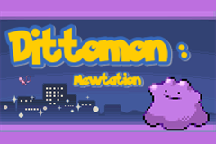

# Dittomon: Mewtation Beta



**One Pokemon. Every Pokemon is a possibility.**

**Dittomon: Mewtation** is a work-in-progress beta Pokemon FireRed hack about one unstable Ditto and the strange systems growing around it.

You do not catch a normal team. You do not build six Pokemon and play FireRed straight. You travel through Kanto with one Dittomon, scout what the world has to offer, copy useful forms, borrow moves, manipulate abilities, and turn familiar Pokemon knowledge into a survival tool.

This is a **BPS patch only**. No ROM file is included.

## Play Here

Download **`PLAY-HERE_Dittomon_Mewtation_Beta_2026-09-04.zip`** from this repository.

That ZIP contains the BPS patch, checksum log, and README. Apply the `.bps` patch inside it to a clean Pokemon FireRed USA 1.0 ROM. Do not use an already-patched ROM.

## Beta Notice

To the Pokemon community at large: this is a public beta, not a final release.

The core Dittomon loop is playable, but balance, text, trainer design, progression hooks, quality-of-life details, and custom puzzle fights are still actively being revised. Some edges will be rough. Some NPCs are still being rewritten. Some fights are experiments. That is the point of this beta: to let players test the idea while it is still alive enough to change.

Feedback is welcome, especially crashes, softlocks, confusing progression, device-specific problems, and battles that feel broken rather than merely mean.

## How To Patch

Dittomon is distributed as a **BPS patch only**. No ROM file is included and no ROM file should be distributed.

You need a clean, unmodified **Pokemon FireRed USA 1.0** ROM as the base.

Commonly shown as:

```text
Pokemon - Fire Red Version (U) (V1.0) [Squirrels].gba
ROM code: BPRE
MD5:  e26ee0d44e809351c8ce2d73c7400cdd
SHA1: 41cb23d8dccc8ebd7c649cd8fbb58eeace6e2fdc
```

Do **not** patch FireRed 1.1, LeafGreen, a randomized ROM, or an already-patched ROM.

Recommended patching flow:

1. Make a copy of your clean FireRed USA 1.0 ROM.
2. Open a BPS-compatible patcher, such as **Floating IPS/Flips** or **RomPatcher JS**.
3. Select the clean FireRed ROM as the source/input file.
4. Select the Dittomon `.bps` patch.
5. Save the patched output as a new `.gba` file.
6. Load the patched ROM in mGBA or your preferred GBA emulator.

If your patcher reports a checksum mismatch, stop and use the correct FireRed USA 1.0 base.

## What Kind Of Game Is This?

Dittomon keeps the familiar shape of FireRed Kanto, but changes what progress means.

Instead of catching Pokemon, you hunt for options. A wild encounter might not join you, but it might show you a form, ability, move, or matchup that matters later. Trainer battles are not only obstacles; they are information. The player is meant to learn by testing, losing, adapting, and coming back smarter.

The project is moving toward authored Dittomon puzzle battles: fights where the enemy abuses one mechanical rule until Dittomon learns how to answer it.

If you know Pokemon mechanics, abilities, learnsets, and weird matchup interactions, that knowledge should feel useful here.

## Current Features

* Dittomon-only solo-mon structure
* Catching and most gift-Pokemon acquisition blocked to preserve the one-mon run
* The Pokemon Utility Menu, or PUM
* Transform-centered progression
* Sketch-style move acquisition
* Ability copying through Mewt Ability
* Mewt stat options and Lab support tools
* Dittomon scorecard/memory systems
* Early custom Dittomon tutorial battles and progression gates
* Reworked old-man catching tutorial
* Custom Pallet, Viridian, Brock, and early Kanto text pass work
* Optional Hardcore Mode with harsher KO consequences
* PokeRoll/randomizer support access through early-game NPCs
* Badge-scaled wild encounter variety
* Route-preserving wild pools with anomaly encounters
* Expanded and rebalanced trainer teams
* Early puzzle-trainer framework
* Reduced item economy and altered shop/item access
* Safari Zone encounters converted into normal battles
* Field utility changes built around Dittomon
* Fly available from the summary menu after the proper badge
* Custom Dittomon title screen and intro
* Mewtation-themed story and NPC text in key places

The exact systems are meant to be discovered through play. If the game lets you do it, it is probably fair game.

## Rules

Win with Dittomon.

That is the real rule. The hack is designed to bake its restrictions into the game itself. If Dittomon can do something, you are allowed to do it.

There is no required external ruleset, no honor-code catch ban, and no need to pretend the game is vanilla FireRed. Scout forms. Revisit areas. Talk to people. Check Oak's Lab. Try strange ideas. The game is about finding what Dittomon can become.

## Hardcore Mode

Hardcore Mode is available through an early Pallet Town support NPC.

It is closer to the intended high-pressure version of the game: blackouts are harsher, Dittomon recovery matters more, and the run leans harder into adaptation instead of comfort. New players may want to try normal mode first, but Hardcore Mode is there if you want the sharper loop.

## Known Beta Notes

This is still a beta.

Some text is still being rewritten. Some vanilla NPCs remain untouched. Some custom fights are only the beginning of a larger puzzle-trainer structure. Balance will keep moving as players find broken strategies, dead ends, and unexpectedly perfect nonsense.

Please save normally. If you find a crash or softlock, report:

* emulator/device
* build date or patch filename
* where it happened
* what Dittomon was transformed into, if relevant
* whether Hardcore Mode was on
* what happened immediately before the issue

mGBA is the primary desktop recommendation. Handheld/device testing is also valuable, especially for Anbernic/ArkOS-style setups.

## Planned Direction

Future builds are aimed at making Dittomon feel less like a ruleset on top of FireRed and more like its own authored game.

Planned work includes:

* more custom puzzle trainers
* more Mewtation unlock fights
* more complete NPC writing passes
* stronger boss identity
* cleaner optional Hardcore Mode pacing
* additional route/dungeon clue design
* better beta documentation as systems settle

## Distribution

Distribute the BPS patch and documentation only.

Do not distribute ROM files.

Do not sell this project or place it behind paid access.

This is a noncommercial fan project.

## Credits

Dittomon: Mewtation is an **Illiterally Custom!**

Concept, design, writing, and direction by **Illy / Illiterally**.

Dittomon uses **Complete FireRed Upgrade** by Skeli789 and contributors.

Additional planning and implementation support came from ChatGPT and Codex.

Pokemon, FireRed, and all original Pokemon assets belong to Nintendo, Game Freak, and Creatures.

## Contact

Email: [IlliterallyIlly@gmail.com](mailto:IlliterallyIlly@gmail.com)

Discord: Illiteralley

Discord invite: <https://discord.gg/4VD8NHH6>
